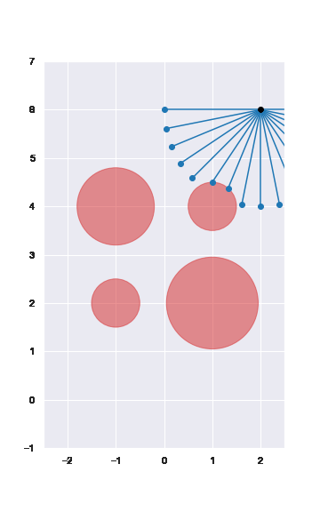

# Sequential convex programming
This reposit is the implementation of sequential convex programming in Python. The implementation depends on numpy and cvxopt. You can start running the code in notebooks/test_unicycle.ipynb or notebooks/test_RocketLanding3D.ipynb 

## References
* Successive Convexification for 6-DoF Mars
Rocket Powered Landing with Free-Final-Time (https://arxiv.org/pdf/1802.03827.pdf)
* Successive Convexification of Non-Convex Optimal Control Problems with State Constraints (https://www.sciencedirect.com/science/article/pii/S2405896317312405)
* Successive convexification of non-convex optimal control problems and its convergence properties (https://ieeexplore.ieee.org/abstract/document/7798816)

## TODO
* final time free
* Quadratic approximation for the cost
* Integration with odeFun

## Obstacle avoidance for a quadrotor

## 3D Landing

## Unicycle Driving
